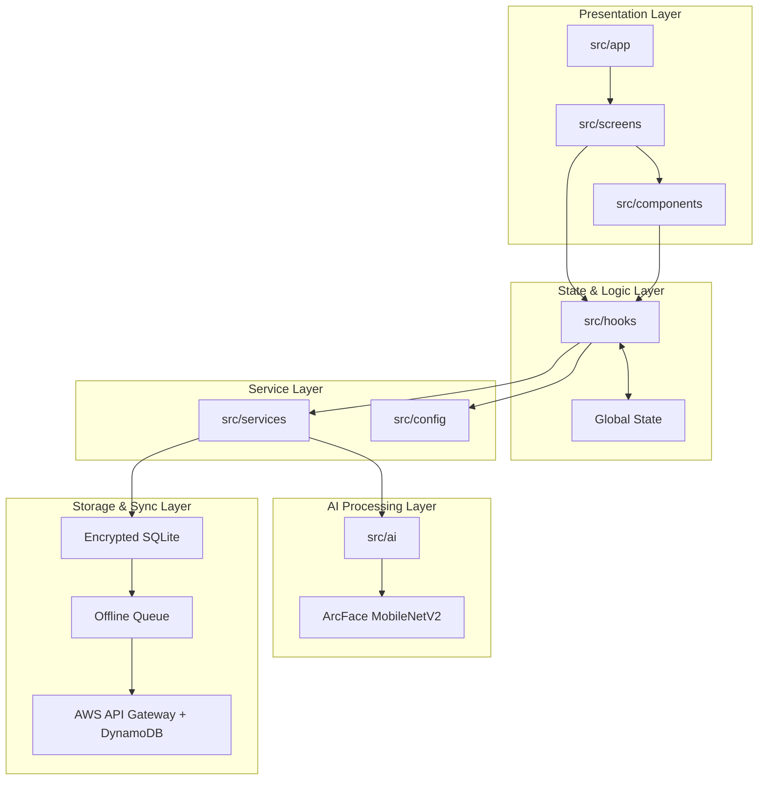
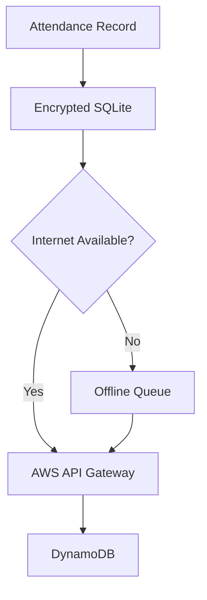

# ARCHITECTURE.md

## 1. Architectural Overview

Netraksh AI is a React Native application designed for offline-first face recognition and attendance management. The system performs face detection, feature extraction, and verification directly on the device, reducing dependency on internet connectivity and improving user privacy.

The application follows a layered architecture that separates the user interface, business logic, AI processing, and data storage components. This structure keeps the codebase organized, easier to maintain, and scalable for future development.

When the device is offline, attendance records are stored locally in an encrypted database. Once an internet connection becomes available, the records are automatically synchronized with the cloud.



---

## 2. Project Structure

```text
src/
├── ai/             # Face recognition and ML logic
├── app/            # App entry point and navigation
├── assets/         # Models and static assets
├── components/     # Reusable UI components
├── config/         # Configuration files
├── hooks/          # Custom React hooks
├── screens/        # Application screens
├── services/       # Database and API services
├── store/          # Global state management
├── types/          # TypeScript interfaces
└── utils/          # Helper functions

docs/
├── ARCHITECTURE.md
├── BENCHMARKS.md
├── MODEL_EXPLANATION.md
└── NEXT_STEPS.md

resources/
└── images/
    └── logo.png
```

---

## 3. Core Components

### Screens

The screens folder contains all user-facing pages of the application. Each screen focuses on presenting information and handling user interactions.

### Components

Reusable UI elements such as buttons, cards, status indicators, and face detection overlays are stored here.

### Hooks & Store

Custom hooks manage communication between the UI and backend services. Global application state is maintained using a centralized store.

Examples include:

* Face recognition status
* Attendance records
* Synchronization status
* User session information

### Services

The services layer handles:

* Database operations
* Encryption
* API communication
* Offline synchronization

### AI Module

The AI module is responsible for:

* Face detection
* Image preprocessing
* Embedding generation
* Face matching
* Liveness verification

---

## 4. Face Recognition Pipeline

Netraksh AI performs all biometric processing locally on the device.


### Process Flow

1. A frame is captured from the device camera.
2. The face is detected using ML Kit.
3. The detected face is cropped and resized.
4. The image is passed to the ArcFace model.
5. A 512-dimensional face embedding is generated.
6. The embedding is compared with stored templates using cosine similarity.

### Model Details

**Model:** ArcFace MobileNetV2

**Advantages**

* Lightweight and mobile-friendly
* Fast inference on smartphones
* High face recognition accuracy

**Model Size**

* Approximately 5–15 MB

**Average Inference Time**

* Less than 300 ms on supported devices

---

## 5. Security & Data Protection

User privacy is a key consideration in the system design.

### Local Encryption

Face embeddings are encrypted using AES-256 before being stored in SQLite.

### No Raw Image Storage

The application stores face embeddings rather than original facial images whenever possible.

### Temporary Data Cleanup

Temporary image crops and processing buffers are removed after verification is completed.

---

## 6. Offline Synchronization

The application is designed to function even without internet connectivity.



### Offline Mode

Attendance records are stored locally until a network connection becomes available.

### Online Mode

When connectivity is restored, queued records are automatically uploaded to the cloud.

### Retry Mechanism

If synchronization fails, records remain in the queue and are retried automatically to prevent data loss.

---

## 7. Key Design Goals

### Offline First

The system remains fully functional without internet access.

### Privacy Focused

Face processing is performed locally on the device.

### Secure

Sensitive biometric data is encrypted before storage.

### Scalable

Cloud synchronization enables centralized record management.

### Efficient

Lightweight models allow deployment on standard Android devices.

---

## 8. Future Enhancements

* Improved liveness detection
* Multi-face tracking support
* Hardware acceleration using NNAPI and CoreML
* Administrative analytics dashboard
* Bulk employee enrollment
* Role-based access control
* Performance optimization for low-end devices

---
