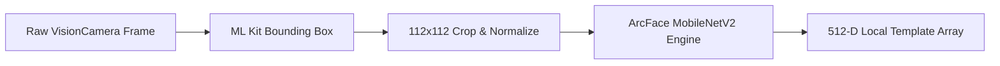
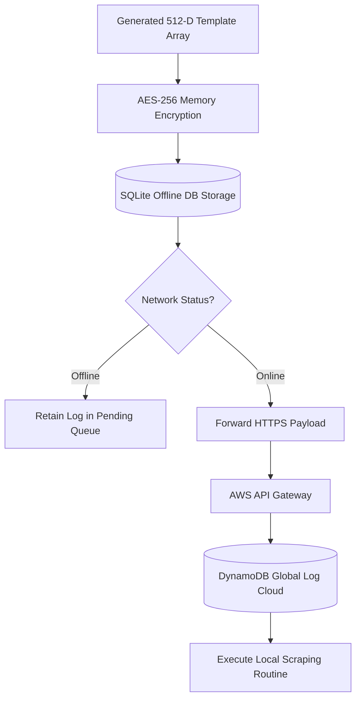

<<<<<<< Updated upstream
# Architecture

The project uses a layered React Native structure so future offline biometric features can be added without placing business logic inside UI components.

## Project Structure

Based on the repository, the root directories and configuration files are organized as follows:

*   **`.bundle/`**:
    *   `config`# ARCHITECTURE.md

## 1. Architectural Overview

Netraksh AI is architected using a decoupled, layered framework designed specifically for offline-first biometric operations on edge mobile environments. By separating the UI rendering layer from the heavy biometric execution pipelines, the application ensures high frame rates during camera tracking while simultaneously running computationally intensive machine learning inferences safely on-device.

```mermaid
flowchart TD
    subgraph Presentation Layer
        App[src/app (Routing/Providers)] --> Screens[src/screens]
        Screens --> Components[src/components]
    end
    
    subgraph Bridge Layer
        Screens --> Hooks[src/hooks]
        Components --> Hooks
    end
    
    subgraph Execution & State Layer
        Hooks --> Services[src/services]
        Hooks --> Config[src/config]
    end
    
    subgraph Edge AI Core
        Services --> AI_Module[src/ai]
        AI_Module --> ArcFace[ArcFace MobileNetV2 Model]
    end
    
    subgraph Persistence & Sync Layer
        Services --> DB[(Encrypted SQLite DB)]
        DB --> SyncQueue[Offline Sync Queue]
        SyncQueue --> Cloud[AWS API Gateway + DynamoDB]
    end
```

---

## 2. Comprehensive Repository Structure

The physical layout of the repository cleanly segregates environmental assets, platform build configurations, metadata documents, and decoupled software layers:

```text
├── .bundle/
│   └── config
├── android/
│   └── app, gradle, build.gradle, gradle.properties, gradlew, settings.gradle
├── ios/
│   └── NetrakshAI, NetrakshAI.xcodeproj, NetrakshAI.xcworkspace, Podfile, Podfile.lock
├── docs/
│   └── ARCHITECTURE.md, BENCHMARKS.md, MODEL_EXPLANATION.md, NEXT_STEPS.md
├── resources/
│   └── images/
│       └── logo.png
└── src/
    ├── ai/
    ├── app/
    ├── assets/
    ├── components/
    ├── config/
    ├── hooks/
    ├── screens/
    ├── services/
    ├── types/
    └── utils/
```

---

## 3. Core Software Layer Breakdown

### 📂 src/screens (View Architecture)

* Responsibility: Dictates visual context boundaries, handles screen-level layout composition, and coordinates screen transition states.
* Constraints: Prohibited from processing cryptographic calculations or decoding raw model matrices. Screens dynamically fetch operational data states exclusively via hooks.

### 📂 src/components (Atomic Components)

* Responsibility: Houses generic visual molecules such as custom bounding frames, action triggers, and modular status fields.
* Constraints: Must remain purely domain-agnostic and fully stateless regarding core biometric rules. Configurations are ingested purely via React props.

### 📂 src/hooks (The Reactive Bridge)

* Responsibility: Completely isolates screen rendering code from heavy algorithmic modules. Custom lifecycle hooks transform backend actions into reactive states (`matchScore`, `isProcessing`, `livenessStatus`) for the frontend layout.

### 📂 src/ai (Biometric & Edge Inference Engine)

* Responsibility: Governs the entire edge computing framework. It manages multi-stage image pre-processing, isolates geometric face coordinates, runs vector projection graphs, and evaluates spatial similarity margins.

### 📂 src/services (Device Infrastructure)

* Responsibility: Controls structural persistence boundaries, local file tracking parameters, database lifecycles, and operational background transactional pipelines.

### 📂 Configuration & Types

#### src/config

Holds immutable application state declarations including target model keys, fallback system boundaries, and active verification thresholds.

#### src/types

Declares explicit compile-time safety contracts used uniformly across business models.

#### src/utils

Provides pure functional execution tools such as timestamp engines, validation wrappers, and numeric standardizers.

---

## 4. Edge AI Core & Machine Learning Integration

Netraksh AI runs a self-contained metric learning biometric stack optimized explicitly to deliver line-rate speeds on resource-constrained hardware.



### A. Core Feature Extraction Model: ArcFace MobileNetV2

* Profile: Additive Angular Margin Loss deep neural structural framework mapped over a light MobileNetV2 core.
* Storage Footprint: Quantized and structured into production-ready `.tflite` or `.onnx` formats consuming only 5MB–15MB of device space.
* Processing Speed: Completes execution graphs within a localized sub-300ms inference loop running entirely on client threads.

### B. Face Embedding Generation Pipeline

1. Face Region Extraction using ML Kit.
2. Geometric Normalization to 112×112 pixels.
3. RGB scaling to [-1, 1].
4. ArcFace inference producing a 512-dimensional embedding.

### C. Similarity Utility Model

Cosine similarity is used for biometric matching.

\text{Cosine Similarity}=\frac{A\cdot B}{|A||B|}

### D. Dynamic Thresholding Engine

* Low-Light Scenarios: Increase threshold from 0.60 to 0.65.
* Liveness Integrity Alerts: Tighten verification conditions.
* Hardware Profile Mitigation: Normalize FRR across lower-quality sensors.

### E. AI Benchmark Suite

* Measures inference time.
* Tracks peak memory usage.
* Records similarity scores.
* Generates diagnostic telemetry reports.

---

## 5. Security & Synchronization Architecture



### Data Hardening Layer

* Face embeddings are encrypted using AES-256 before SQLite storage.
* Only encrypted templates are persisted locally.

### Volatile Memory Sanitization

* Temporary face crops.
* Intermediate arrays.
* Runtime buffers.

All are destroyed after processing to minimize privacy risks.

### Transactional Cloud Sync Engine

* Offline events are stored locally.
* Synchronization occurs automatically when connectivity is restored.
* Data is securely transferred through AWS API Gateway into DynamoDB.
* Successfully synced records are removed from local storage.

*   **`android/`**: 
    *   `app`, `gradle`, `build.gradle`, `gradle.properties`, `gradlew`, `gradlew.bat`, `settings.gradle`
*   **`docs/`**: 
    *   `ARCHITECTURE.md`, `BENCHMARKS.md`, `MODEL_EXPLANATION.md`, `NEXT_STEPS.md`, `PRESENTATION_OUTLINE.md`, `PROJECT_OVERVIEW.md`, `README_SETUP.md`, `TESTING_REPORT.md`
*   **`ios/`**: 
    *   `NetrakshAI`, `NetrakshAI.xcodeproj`, `NetrakshAI.xcworkspace`, `.xcode.env`, `Podfile`, `Podfile.lock`
*   **`resources/images/`**: 
    *   `logo_with_name.png`, `logo.png`
*   **Root Configuration Files**: 
    *   `.eslintrc.js`, `.gitignore`, `.nvmrc`, `.prettierrc`, `.watchmanconfig`, `app.json`, `babel.config.js`, `Gemfile`, `index.js`, `jest.setup.ts`, `metro.config.js`, `package-lock.json`, `package.json`, `tsconfig.json`

## `src` Directory Breakdown

*   **`src/screens`**: Own screen-level layout and navigation actions. They should call services or hooks when real behavior is added.
*   **`src/components`**: Reusable UI building blocks. They should remain generic and avoid domain-specific side effects.
*   **`src/services`**: Define the boundaries for facial detection, embedding generation, liveness verification, matching, secure storage, offline database access, and sync. Most service methods are placeholders in this step.
*   **`src/config`**: Centralizes app constants, model version placeholders, demo flags, and authentication thresholds.
*   **`src/types`**: Define the shared domain contracts used across services and future screens.
*   **`src/utils`**: Provide small pure helpers such as validation and timestamp generation.
=======
>>>>>>> Stashed changes
