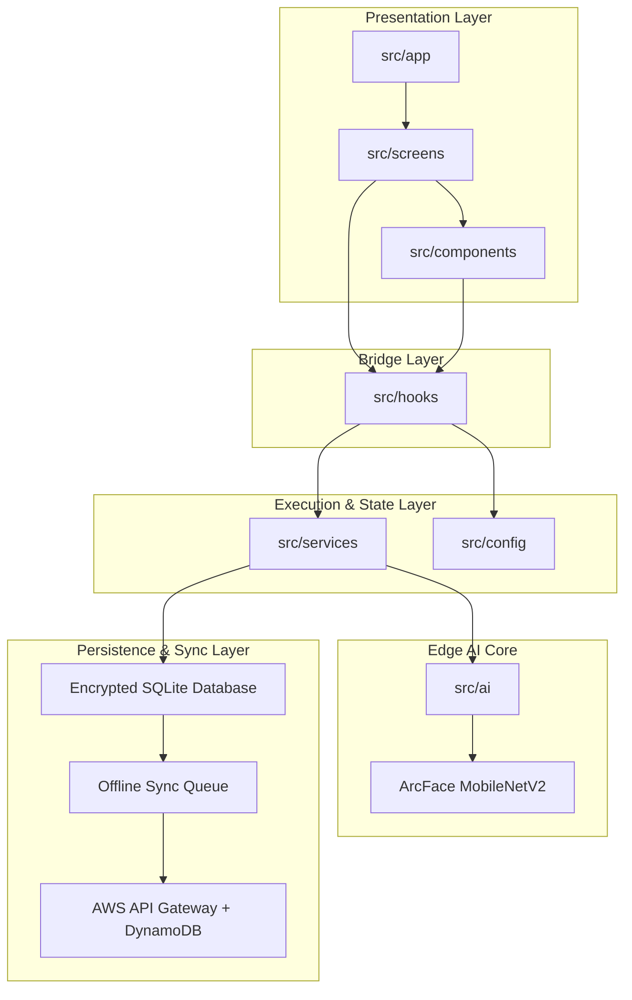
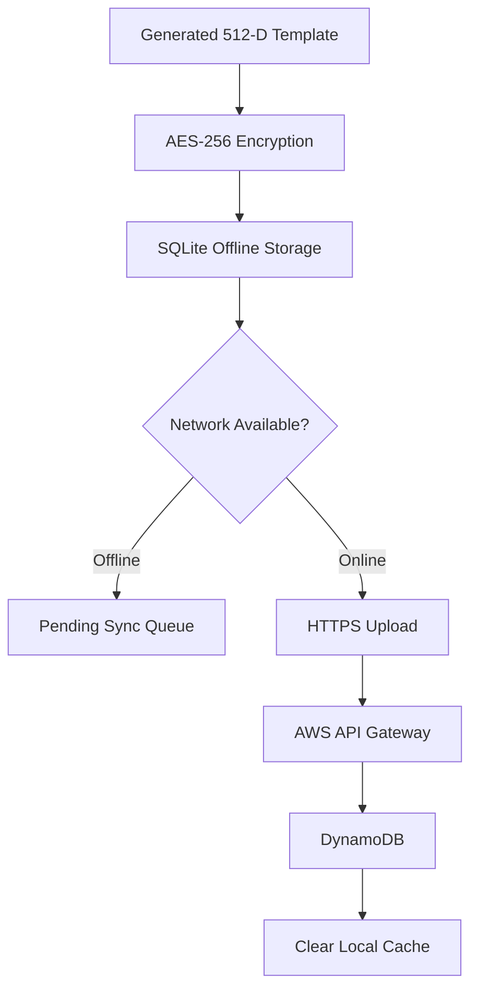

# ARCHITECTURE.md

## 1. Architectural Overview

Netraksh AI is architected using a decoupled, layered framework designed specifically for offline-first biometric operations on edge mobile environments. By separating the UI rendering layer from the heavy biometric execution pipelines, the application ensures high frame rates during camera tracking while simultaneously running computationally intensive machine learning inferences safely on-device.



---

## 2. Comprehensive Repository Structure

The physical layout of the repository cleanly segregates environmental assets, platform build configurations, metadata documents, and decoupled software layers:

```text
├── .bundle/
│   └── config
├── android/
│   ├── app/
│   ├── gradle/
│   ├── build.gradle
│   ├── gradle.properties
│   ├── gradlew
│   └── settings.gradle
│
├── ios/
│   ├── NetrakshAI/
│   ├── NetrakshAI.xcodeproj/
│   ├── NetrakshAI.xcworkspace/
│   ├── Podfile
│   └── Podfile.lock
│
├── docs/
│   ├── ARCHITECTURE.md
│   ├── BENCHMARKS.md
│   ├── MODEL_EXPLANATION.md
│   └── NEXT_STEPS.md
│
├── resources/
│   └── images/
│       └── logo.png
│
└── src/
    ├── ai/
    ├── app/
    ├── assets/
    ├── components/
    ├── config/
    ├── hooks/
    ├── screens/
    ├── services/
    ├── types/
    └── utils/
```

---

## 3. Core Software Layer Breakdown

### 📂 src/screens (View Architecture)

**Responsibility**

- Dictates visual context boundaries.
- Handles screen-level layout composition.
- Coordinates navigation and transition states.

**Constraints**

- Must not perform cryptographic calculations.
- Must not run machine learning inference directly.
- Retrieves operational state exclusively through hooks.

---

### 📂 src/components (Atomic Components)

**Responsibility**

- Reusable UI building blocks.
- Face bounding boxes.
- Status indicators.
- Action buttons.

**Constraints**

- Domain agnostic.
- Stateless whenever possible.
- Receives configuration via React props.

---

### 📂 src/hooks (Reactive Bridge Layer)

**Responsibility**

Acts as the bridge between frontend views and backend services.

Examples:

- `useFaceRecognition()`
- `useLivenessDetection()`
- `useSyncStatus()`

Exposes frontend states such as:

- `matchScore`
- `isProcessing`
- `livenessStatus`

---

### 📂 src/ai (Edge Inference Engine)

**Responsibility**

Handles all biometric processing.

Includes:

- Face detection
- Image preprocessing
- Embedding generation
- Similarity comparison
- Liveness detection

---

### 📂 src/services (Infrastructure Layer)

**Responsibility**

Controls:

- SQLite operations
- Encryption services
- Sync management
- Local storage lifecycle
- API communication

---

### 📂 src/config

Stores:

- Security thresholds
- Model configuration
- Environment constants
- Feature flags

---

### 📂 src/types

Defines:

- Shared interfaces
- Data contracts
- Application-wide type safety

---

### 📂 src/utils

Contains:

- Validation helpers
- Mathematical utilities
- Timestamp handlers
- Formatting functions

---

## 4. Edge AI Core & Machine Learning Integration

Netraksh AI uses an entirely local biometric pipeline optimized for mobile hardware.


---

### A. Core Feature Extraction Model

#### ArcFace MobileNetV2

**Architecture**

- ArcFace metric learning
- MobileNetV2 backbone

**Advantages**

- Lightweight
- Mobile friendly
- High recognition accuracy

**Deployment Format**

- `.tflite`
- `.onnx`

**Storage Size**

- Approximately 5–15 MB

**Target Inference Time**

- Under 300 ms

---

### B. Face Embedding Generation Pipeline

#### Step 1: Face Detection

ML Kit detects facial boundaries from the live camera feed.

#### Step 2: Face Cropping

Detected face is extracted from the frame.

#### Step 3: Normalization

Image resized to:

```text
112 × 112 pixels
```

Pixel values normalized to:

```text
[-1, 1]
```

#### Step 4: Embedding Creation

ArcFace generates:

```text
512-Dimensional Feature Vector
```

---

### C. Similarity Matching

Face verification is performed using Cosine Similarity.

```text
Cosine Similarity = (A · B) / (||A|| × ||B||)
```

Higher values indicate greater facial similarity.

---

### D. Dynamic Thresholding

Security thresholds adapt according to environmental conditions.

#### Low-Light Conditions

```text
0.60 → 0.65
```

Reduces false acceptance under noisy camera input.

#### Liveness Warnings

Verification thresholds become stricter if spoof indicators are detected.

#### Device Quality Adjustment

Thresholds may be tuned for low-resolution cameras.

---

### E. Benchmarking & Telemetry

The benchmark suite measures:

- Inference latency
- Peak memory usage
- Similarity score distributions
- Sync durations
- Device performance metrics

---

## 5. Security & Synchronization Architecture



---

### Data Protection Layer

Before storage:

1. Face embedding generated.
2. Embedding encrypted using AES-256.
3. Encrypted payload written to SQLite.

No raw facial images are persisted.

---

### Volatile Memory Sanitization

The following are immediately destroyed after processing:

- Temporary image crops
- Embedding buffers
- Intermediate tensors
- Processing arrays

This minimizes exposure of biometric data.

---

### Offline-First Synchronization

#### Offline Mode

Records are stored locally.

```text
SQLite → Pending Queue
```

#### Online Mode

Queued records are uploaded through:

```text
HTTPS → AWS API Gateway → DynamoDB
```

After successful synchronization:

```text
Local Cache Cleared
```

---

## 6. Key Architectural Advantages

### Offline First

Operates without internet connectivity.

### Privacy Preserving

Biometric processing remains on-device.

### Scalable

Supports cloud synchronization when required.

### Lightweight

Optimized for mobile deployment.

### Secure

AES-256 encryption and secure transport mechanisms protect sensitive biometric information.

---

## 7. Future Enhancements

Planned improvements include:

- Multi-face tracking support
- Advanced anti-spoofing models
- Device-specific model optimization
- Federated learning integration
- Enhanced analytics dashboard
- Cross-platform benchmark automation