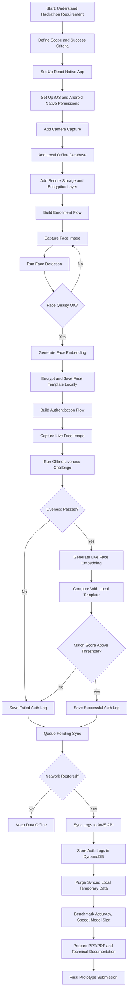
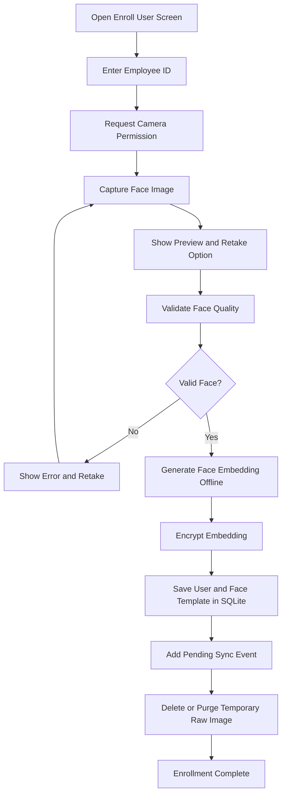
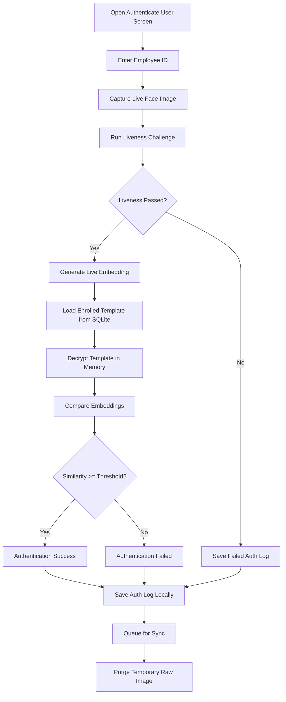
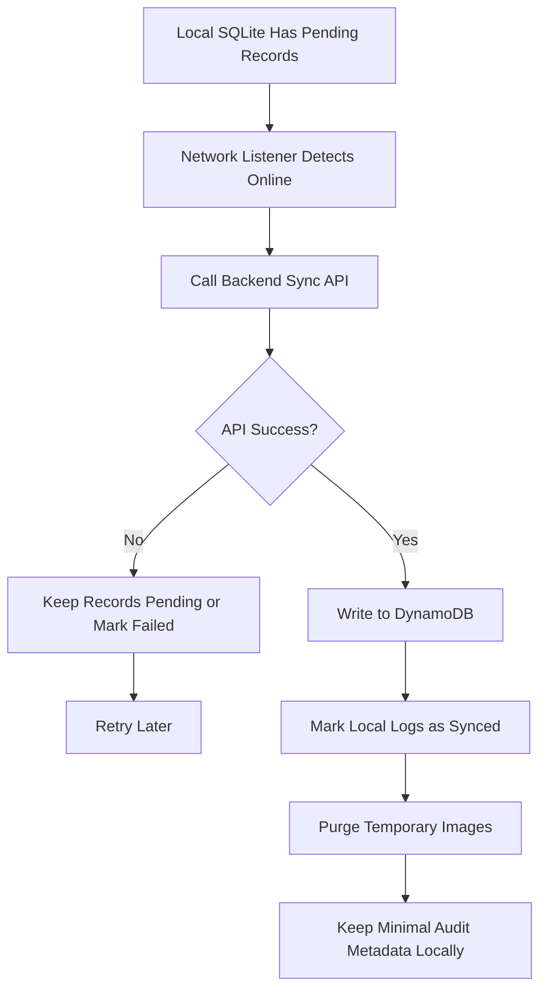
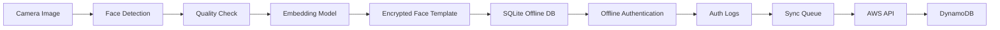

# Development Flow

This flow is based on `hackathon_doc7.pdf`: offline React Native facial recognition, liveness detection, lightweight model, local secure storage, AWS sync/purge, and final documentation.

## End-to-End Development Flow

## Implementation Phases

```mermaid
flowchart LR
  P1[Phase 1: App Foundation] --> P2[Phase 2: Camera and Capture]
  P2 --> P3[Phase 3: Local DB and Encryption]
  P3 --> P4[Phase 4: Enrollment]
  P4 --> P5[Phase 5: Offline Authentication]
  P5 --> P6[Phase 6: Liveness Detection]
  P6 --> P7[Phase 7: AWS Sync and Purge]
  P7 --> P8[Phase 8: Benchmarking]
  P8 --> P9[Phase 9: Documentation and Demo]
```

## Phase Checklist

| Phase                    | Goal                       | Main Tasks                                                                     | Output                           |
| ------------------------ | -------------------------- | ------------------------------------------------------------------------------ | -------------------------------- |
| 1. App foundation        | Stable React Native base   | Navigation, screens, reusable components, app config                           | Working Android/iOS shell        |
| 2. Camera capture        | Capture face image         | VisionCamera setup, permission handling, capture, preview, retake              | Temporary image path and preview |
| 3. Local DB and security | Offline-first storage      | SQLite tables, repositories, secure storage, encryption service                | Local encrypted templates/logs   |
| 4. Enrollment            | Register employee face     | Employee ID, face capture, face detection, quality check, embedding generation | Encrypted local face template    |
| 5. Authentication        | Verify employee offline    | Capture live face, load local template, compare embeddings, threshold result   | Success/failed auth decision     |
| 6. Liveness              | Stop photo/screen spoofing | Blink/smile/head-turn challenge, liveness score, retry handling                | Offline liveness pass/fail       |
| 7. Sync and purge        | Restore server consistency | Pending sync queue, AWS API, DynamoDB table, purge synced temporary data       | Offline-to-online sync           |
| 8. Benchmarking          | Prove constraints          | Measure model size, inference time, accuracy, memory, lighting cases           | Benchmark report                 |
| 9. Documentation         | Final deliverables         | Architecture, integration steps, setup guide, PPT/PDF                          | Submission-ready package         |

## Enrollment Flow

## Authentication Flow

## Sync and Purge Flow

## Data Flow

## Suggested Build Order From Current Project State

1. Finish local DB schema for `users`, `face_templates`, `auth_logs`, and optional `sync_queue`.
2. Add encryption for face embeddings and sensitive payloads.
3. Add face detection interface and mock implementation.
4. Add embedding model interface and mock vector generation.
5. Connect enrollment to save encrypted templates.
6. Connect authentication to compare embeddings locally.
7. Add liveness challenge screens and scoring.
8. Connect pending sync to the DynamoDB backend API.
9. Add purge logic for raw temporary images after enrollment/authentication.
10. Add benchmark screen/report for speed, model size, and accuracy notes.
11. Prepare final architecture diagram, setup guide, and PPT/PDF.

## Acceptance Targets From PDF

| Requirement  | Target                                                   |
| ------------ | -------------------------------------------------------- |
| Platforms    | Android and iOS with React Native                        |
| Network      | Must authenticate offline                                |
| Model size   | Around 20 MB or smaller                                  |
| Speed        | Face recognition plus liveness under 1 second            |
| Hardware     | Mid-range devices, 3 GB RAM, no high-end GPU             |
| OS           | Android 8.0+ and iOS 12+                                 |
| Accuracy     | Greater than 95% target                                  |
| Liveness     | Blink, smile, or head turn                               |
| Sync         | AWS sync after network restore                           |
| Purge        | Purge synced temporary local data                        |
| Deliverables | Source code, prototype, PPT/PDF, technical documentation |
