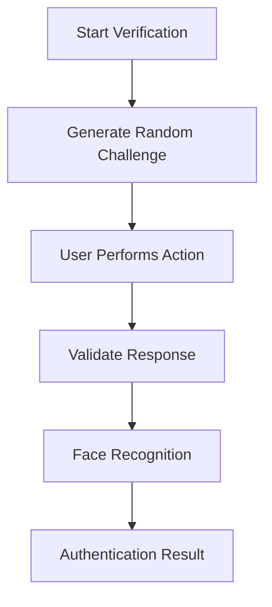

# MODEL_EXPLANATION.md

## 1. Overview

Netraksh AI uses on-device machine learning to perform face recognition and liveness verification without requiring an active internet connection.

The AI pipeline is designed to be lightweight, privacy-focused, and suitable for mobile devices commonly used in field operations. All biometric processing takes place locally on the device, ensuring faster response times and reducing the need to transmit sensitive data over a network.

---

## 2. Face Recognition Model

### Model Used

**ArcFace-MobileNetV2**

ArcFace-MobileNetV2 was selected because it provides a good balance between accuracy, speed, and model size, making it suitable for mobile deployment.

### Key Characteristics

| Feature             | Value               |
| ------------------- | ------------------- |
| Model Architecture  | ArcFace-MobileNetV2 |
| Model Format        | TFLite / ONNX       |
| Model Size          | ~8 MB               |
| Embedding Size      | 512 Dimensions      |
| Processing Location | On-Device           |

### Why ArcFace?

ArcFace is widely used in face recognition systems because it creates highly distinctive facial representations while remaining computationally efficient.

Benefits include:

* Fast inference on mobile devices
* Lightweight model size
* Strong recognition performance
* Suitable for offline applications

---

## 3. Face Recognition Workflow

The face recognition process consists of four main stages.


### Step 1: Face Detection

The camera captures a frame and ML Kit identifies the face within the image.

### Step 2: Face Preprocessing

The detected face is:

* Cropped from the frame
* Resized to 112 × 112 pixels
* Normalized for model input

### Step 3: Embedding Generation

The processed image is passed through the ArcFace model.

The output is a:

```text
512-Dimensional Face Embedding
```

This embedding acts as a unique numerical representation of a person's facial features.

### Step 4: Face Matching

The generated embedding is compared with previously enrolled embeddings stored in the database.

Matching is performed using cosine similarity.

---

## 4. Face Matching Method

Netraksh AI uses cosine similarity to determine how closely two face embeddings match.

\text{Cosine Similarity}=\frac{A\cdot B}{|A||B|}

Where:

* **A** = Current face embedding
* **B** = Stored reference embedding

### Interpretation

| Similarity Score | Result       |
| ---------------- | ------------ |
| High Score       | Likely Match |
| Low Score        | No Match     |

The application uses a configurable threshold to determine whether authentication should be accepted or rejected.

---

## 5. Liveness Detection

Face recognition alone cannot prevent spoofing attempts such as printed photographs or video replays.

To improve security, Netraksh AI includes an active liveness verification system.

### Supported Challenges

* Blink Detection
* Smile Detection
* Head Movement Verification

### Workflow



Only after a valid liveness response is detected does the system proceed to face recognition.

---

## 6. Facial Landmark Analysis

The liveness system tracks facial landmarks provided by the detection engine.

### Blink Detection

The system monitors eye movement and verifies that the user performs a natural blink.

### Smile Detection

The system measures mouth movement and confirms that a smile action has been completed.

### Head Movement Detection

The system checks for left or right head movement to verify that the user is physically present.

These actions help reduce the risk of spoofing using static images or recorded videos.

---

## 7. Adaptive Thresholding

Environmental conditions can affect recognition quality.

To improve reliability, Netraksh AI adjusts matching thresholds based on image quality.

| Condition     | Adjustment                        |
| ------------- | --------------------------------- |
| Good Lighting | Standard Threshold                |
| Low Light     | Slightly Higher Threshold         |
| Motion Blur   | Stricter Verification             |
| Overexposure  | Increased Validation Requirements |

This helps maintain a balance between security and usability.

---

## 8. Privacy & Security

Netraksh AI is designed with privacy in mind.

### Local Processing

All face recognition operations are performed on the device.

### Encrypted Storage

Face embeddings are encrypted before being stored locally.

### No Raw Image Retention

Temporary face images used during processing are removed after verification whenever possible.

### Offline Operation

The application can continue functioning without internet connectivity.

---

## 9. Testing

The AI module is covered by automated tests to ensure consistent behavior.

### Run AI Tests

```bash
npx jest __tests__/aiModule.test.ts
```

### Run All Tests

```bash
npm test
```

### Current Status

* AI Module Tested
* Liveness Logic Tested
* Database Operations Tested
* Validation Utilities Tested

All current test suites pass successfully.

---

## 10. Future Improvements

Planned enhancements include:

* Passive liveness detection
* Multi-face recognition support
* Hardware acceleration using NNAPI and CoreML
* Faster inference on low-end devices
* Improved anti-spoofing techniques
* Performance analytics dashboard

---

## Summary

Netraksh AI combines lightweight face recognition and liveness detection into a mobile-first solution designed for offline operation. By performing all biometric processing on-device and using encrypted local storage, the system provides a secure and practical solution for attendance and identity verification in field environments.
